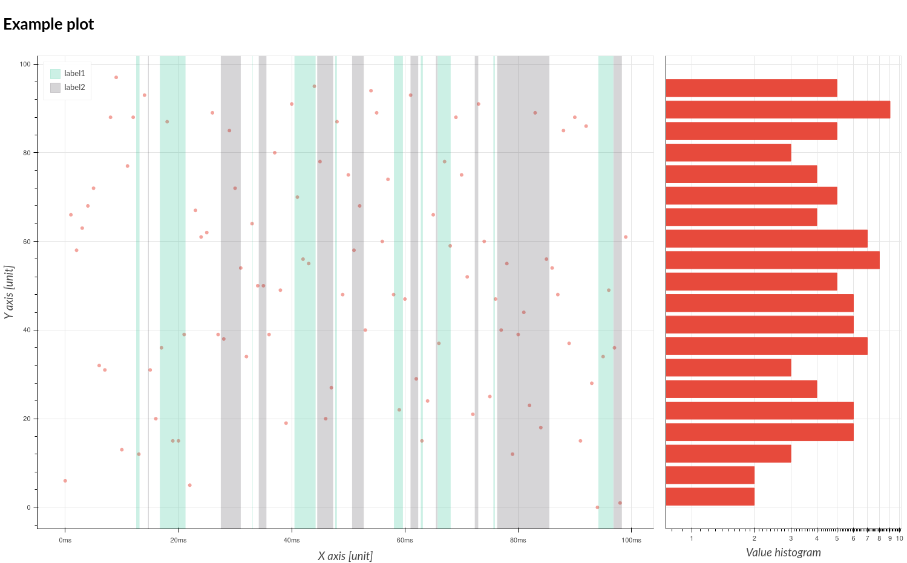

# Servis

Copyright (c) 2022 [Antmicro](https://www.antmicro.com)

A repository for rendering time series plots in various formats.

Examples of projects using the module:

* [Kenning](https://github.com/antmicro/kenning)
* [Sargraph](https://github.com/antmicro/sargraph)

## Requirements

The module supports following backends:

* [plotext](https://github.com/piccolomo/plotext):

    * requires plotext module only,
    * renders plots to the terminal, in txt format
* [bokeh](https://bokeh.org/):

    * requires `bokeh` and `numpy` for HTML rendering,
    * renders images in interactive HTML, PNG and SVG formats,
    * optionally requires [Selenium](https://www.selenium.dev/) and [geckodriver](https://github.com/mozilla/geckodriver) for rendering PNG/SVG plots.
* [matplotlib](https://matplotlib.org/):

    * requires `matplotlib` module,
    * renders plots in SVG/JPG/PNG format.

## Installation

To install base `servis` with `plotext` backend support, run:

```bash
pip install git+https://github.com/antmicro/servis
```

To install additional backends (`bokeh`, `matplotlib`) one can run:

```bash
pip install git+https://github.com/antmicro/servis#egg=servis[<backend-name>]
```

For example:

```bash
pip install git+https://github.com/antmicro/servis#egg=servis[bokeh]
```

## Examples of running Servis

### Rendering TXT plots from standard input

Servis can be run from terminal using:

```
python -m servis -h
```

It can accept a file with space-separated values, representing Y (and optionally X) values.
It can also accept data from standard input.

For example, let's create a file `sample.txt`:

```
1 0
2 1
4 2
8 3
16 4
```

The data can be provided two ways:

```
cat sample.txt | python -m servis
```

or:

```
python -m servis sample.txt
```

It is possible to control the delimiter and plot type - check help (`python -m servis -h`) for details.

### Rendering single plot in all possible extensions

example script:

```python
import json
from servis import render_time_series_plot_with_histogram

with open("data1.json", "r") as data:
    data = json.load(data)

xdata = data["xdata"]
ydata = data["ydata"]

tags = []
for tag in data["tags"]:
    tags.append({
        'name':  tag[0],
        'start': float(tag[1]),
        'end':   float(tag[2])
    })

render_time_series_plot_with_histogram(
    ydata,
    xdata,
    "Example plot",
    "X axis",
    "unit",
    "Y axis",
    "unit",
    outpath="example_plots/singleplot",
    outputext=["txt", "html", "png", "svg"],
    tags=tags,
    tagstype="double",
    backend="matplotlib"
)
```

running script from terminal:


```bash
python3 test1.py
```

Generated plot with PNG extension:




### Rendering double plot:

example script:

```python
import json
from servis import render_multiple_time_series_plot

with open("data2.json", "r") as data:
    data = json.load(data)

xdata = data["xdata"]
ydata1 = data["ydata1"]
ydata2 = data["ydata2"]

tags = []
for tag in data["tags"]:
    tags.append({
        'name':  tag[0],
        'timestamp': float(tag[1])
    })

render_multiple_time_series_plot(
    [ydata1, ydata2],
    xdata,
    title="Example plot",
    subtitles=["Plot1", "Plot2"],
    xtitles=["X axis"]*2,
    xunits=["unit"]*2,
    ytitles=["Y axis"]*2,
    yunits=["unit"]*2,
    y_range=(-5, 105),
    outpath="example_plots/multipleplot",
    outputext=["png", "html"],
    tags=tags,
    tagstype="single",
    backend="matplotlib"
)
```

running script from terminal:


```bash
python3 test2.py
```

Generated TXT plot:


Example PNG double plot:


