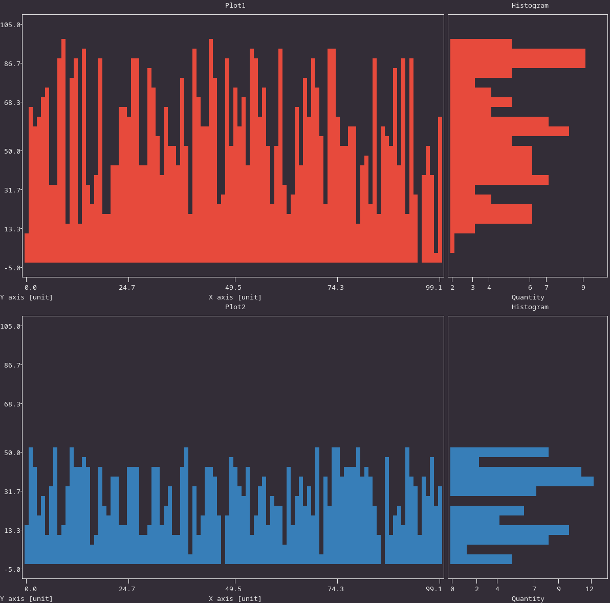

# Kenning plots

A repository for rendering time series plots in various formats.

Examples of projects using the module:

* [Kenning](https://github.com/antmicro/kenning)
* [Sargraph](https://github.com/antmicro/sargraph)

## Examples of running time_series_plot

### Rendering inference plot based on example kenning output in all possible extensions

example script:

```python:
from csv import reader
import ast
from time_series_plot import render_time_series_plot_with_histogram

with open("data1.csv", 'r') as csvfile:
    csv_reader = reader(csvfile)
    rows = [row for row in csv_reader]

xdata = [int(x) for x in rows[0]]
ydata = [int(x) for x in rows[1]]

tags = []
for tag in rows[2]:
    tag = ast.literal_eval(tag)
    tags.append({
        'name':  tag[0],
        'start': float(tag[1]),
        'end':   float(tag[2])
    })

render_time_series_plot_with_histogram(
    "example_plots/singleplot",
    ["txt", "html", "png"],
    "Example plot",
    "X axis",
    "unit",
    "Y axis",
    "unit",
    xdata,
    ydata,
    tags=tags,
    tagstype="double"
)

```

running script from terminal: 


```
python3 test1.py
```

Generated plot with PNG extension:


### Rendering double plot:

example script:

```
from csv import reader
import ast
from time_series_plot import render_multiple_time_series_plot

with open("data2.csv", 'r') as csvfile:
    csv_reader = reader(csvfile)
    rows = [row for row in csv_reader]

xdata = [int(x) for x in rows[0]]
ydata1 = [int(x) for x in rows[1]]
ydata2 = [int(x) for x in rows[2]]

tags = []
for tag in rows[3]:
    tag = ast.literal_eval(tag)
    tags.append({
        'name':  tag[0],
        'timestamp': float(tag[1])
    })

render_multiple_time_series_plot(
    2,
    "example_plots/multipleplot",
    ["txt"],
    "Example plot",
    ["Plot1", "Plot2"],
    ["X axis"]*2,
    ["unit"]*2,
    ["Y axis"]*2,
    ["unit"]*2,
    xdata,
    [ydata1, ydata2],
    tags=tags,
    tagstype="single",
    figsize=(100, 20)
)
```

running script from terminal: 


```
python3 test2.py
```

Generated TXT plot:



Example PNG double plot:

